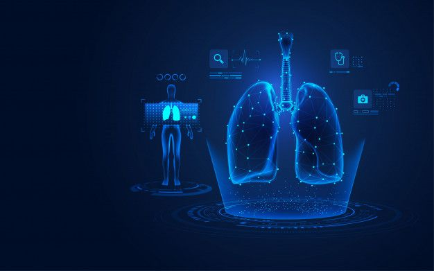

# Tumor-Detection-with-PaddleSeg: Medical AI for Lung Tumor Detection

**Tumor-Detection-with-PaddleSeg** is a high-precision medical imaging framework designed for the semantic segmentation and classification of lung tumors using radiological scans, including chest X-rays and CT slices. The system integrates deep learning models for dense pixel-wise segmentation (via PaddleSeg) and lesion-level classification (via PaddleClas), optimized for research, clinical aid, and medical data annotation tasks.

---

## Project Scope

The objective oF Tumor-Detection-with-PaddleSeg is to deliver an interpretable, modular, and open framework for analyzing thoracic radiology datasets. The system enables physicians, researchers, and healthcare providers to automatically segment tumor regions, predict malignancy likelihood, and assist in screening workflows for pulmonary disease.

---

## Capabilities

- **Pixel-Level Tumor Segmentation**
- **Multi-Class Lesion Classification (Benign, Malignant, Uncertain)**
- **Heatmap Visualization for Region Importance**
- **Cross-Modality Compatibility (X-ray, CT, PNG, DICOM)**
- **Overlay & Comparison of Annotated and Predicted Masks**
- **Support for Multiphase CT Volumes**
  
---

## 🖼️ Visual Demonstration

<p align="center">
  
</p>

<p align="center">
  <em>Fig: AI-based Lung Tumor Detection – shows deep learning-assisted visualization on a thoracic scan</em>
</p>

---

---

## Stack

- **Core Framework**: [PaddleSeg](https://github.com/PaddlePaddle/PaddleSeg)
- **Classification Module**: [PaddleClas](https://github.com/PaddlePaddle/PaddleClas)
- **Preprocessing**: SimpleITK, OpenCV, NumPy, SciPy
- **Visualization**: Matplotlib, Seaborn, Plotly
- **Deployment**: PaddleInference, FastDeploy (optional)

---

## Datasets

TumorScope is compatible with major open-access thoracic imaging datasets:

- **LIDC-IDRI**  
  > CT scans with marked lesions, malignancy scores, and annotations.
- **ChestXray14**  
  > NIH dataset with 14 labeled diseases including lung masses and nodules.
- **COVIDx (optional)**  
  > CXR dataset relevant for COVID-associated pneumonia and lung damage.

Dataset links and preprocessing scripts are available in the `/data` directory.

---

## Applications

- Radiologist Workflow Acceleration
- Pulmonary Oncology Research
- Radiology Dataset Annotation Tooling
- Comparative Studies of Segmentation Models
- Educational Tools for Medical Training
- Ground Truth Generation for Multicenter Studies

---

## Repository Structure

```bash
tumorscope-medical-ai/
│
├── data/                      # Raw/processed datasets (preprocessing scripts included)
├── notebooks/                 # Training, evaluation, and analysis notebooks
├── models/
│   ├── segmentation/          # PaddleSeg configs and checkpoints
│   └── classification/        # PaddleClas model configs and weights
│
├── src/
│   ├── preprocess/            # DICOM/PNG loaders, resizing, normalization
│   ├── seg_utils/             # Segmentation inference and visualization
│   ├── cls_utils/             # Classification pipeline and results interpretation
│   └── visualization/         # Mask overlays, heatmaps, ROC plots
│
├── outputs/                   # Model predictions, visual outputs, reports
├── requirements.txt
├── LICENSE
└── README.md
````

---

## Installation

```bash
git clone https://github.com/yourusername/tumorscope-medical-ai.git
cd tumorscope-medical-ai
pip install -r requirements.txt
```

---

## Quick Start

1. Download the dataset(s) and place them in `data/`
2. Configure segmentation model in `models/segmentation/config.yaml`
3. Run the segmentation pipeline:

```bash
python src/seg_utils/infer_segment.py --image data/sample_ct.png
```

4. Run the classification pipeline:

```bash
python src/cls_utils/infer_classify.py --image data/sample_ct.png
```

---

## Research & Development Inspiration

This project integrates ideas and methods from multiple leading research institutions and healthcare AI labs:

* Harvard Medical AI: Clinical Decision Support Systems
* Oxford Big Data Institute: Precision Imaging
* Stanford AIMI: Imaging Informatics and Segmentation
* PKU Medical Imaging Lab: Pulmonary Image Annotation Systems

---

## Roadmap

* [x] X-ray Image Tumor Segmentation
* [x] CT Slice Segmentation using LIDC-IDRI
* [x] PaddleClas Integration for Malignancy Detection
* [ ] DICOM Sequence Support with 3D Mask Overlay
* [ ] Interactive Web Interface (Streamlit or Dash)
* [ ] Model Explainability using Grad-CAM

---

## Citation

If this repository contributes to your work or research, please consider referencing or citing it in publications.

---

## License

Distributed under the MIT License. See `LICENSE` for details.
